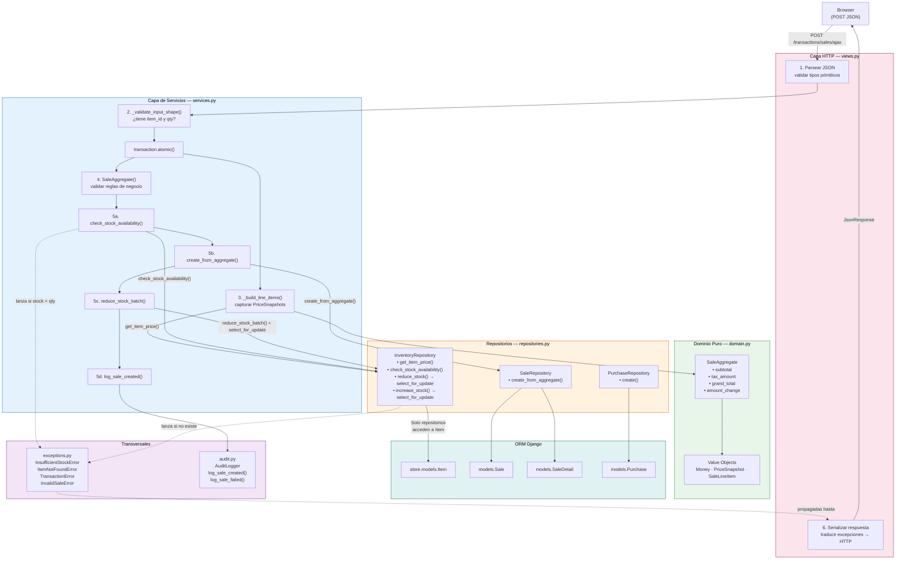
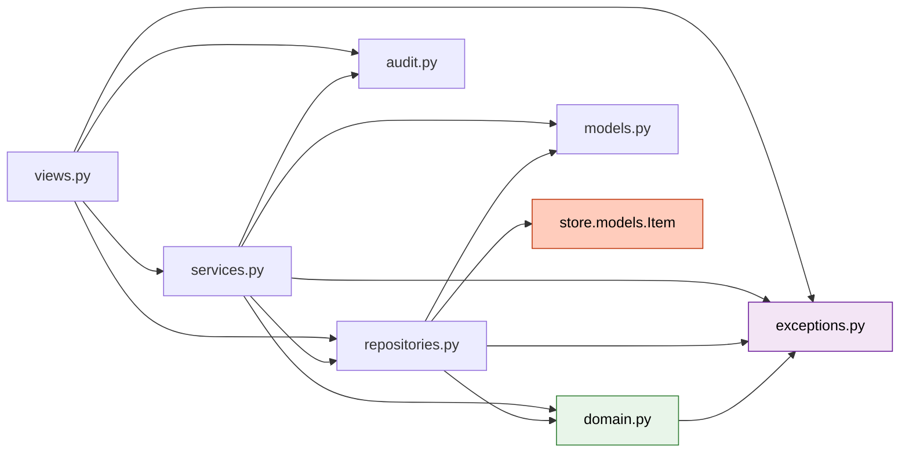

# Análisis de Re-Arquitectura: `transactions/`

> Commit de referencia: `3fab4a4` (antes) → `a09d22f` (después)  
> Autor del análisis: Arquitecto de Software Senior  
> Fecha: 2026-05-18

---

## Tabla de Contenidos

1. [Contexto y motivación](#1-contexto-y-motivación)
2. [Cambios estructurales a nivel de carpetas y módulos](#2-cambios-estructurales-a-nivel-de-carpetas-y-módulos)
3. [Patrones de diseño implementados](#3-patrones-de-diseño-implementados)
4. [Análisis detallado: Antes vs. Después por componente](#4-análisis-detallado-antes-vs-después-por-componente)
   - 4.1 [views.py — La vista gorda → Vista delgada](#41-viewspy--la-vista-gorda--vista-delgada)
   - 4.2 [models.py — Lógica de negocio en `save()`](#42-modelspy--lógica-de-negocio-en-save)
   - 4.3 [exceptions.py — NUEVO](#43-exceptionspy--nuevo)
   - 4.4 [domain.py — NUEVO](#44-domainpy--nuevo)
   - 4.5 [repositories.py — NUEVO](#45-repositoriespy--nuevo)
   - 4.6 [services.py — NUEVO](#46-servicespy--nuevo)
   - 4.7 [audit.py — NUEVO](#47-auditpy--nuevo)
   - 4.8 [tests/ — Nuevo paquete de pruebas](#48-tests--nuevo-paquete-de-pruebas)
   - 4.9 [signals.py — ELIMINADO](#49-signalspy--eliminado)
5. [Race condition corregida](#5-race-condition-corregida)
6. [Flujo de datos: Nuevo diagrama Mermaid](#6-flujo-de-datos-nuevo-diagrama-mermaid)
7. [Diagrama de dependencias entre módulos](#7-diagrama-de-dependencias-entre-módulos)
8. [Resumen de métricas](#8-resumen-de-métricas)
9. [Deuda técnica restante](#9-deuda-técnica-restante)

---

## 1. Contexto y motivación

El módulo `transactions` era el punto más crítico y frágil del sistema. Todo —validación, lógica de negocio, acceso a datos, manejo de errores y auditoría— estaba concentrado en `views.py`. El resultado era una función `SaleCreateView` de 115 líneas que:

- Importaba directamente `store.models.Item` (acoplamiento entre apps)
- Actualizaba el stock con `item.quantity -= qty; item.save()` sin bloqueo de fila (race condition)
- No tenía excepciones de dominio: usaba `ValueError` genérico
- Era imposible de testear sin levantar un servidor HTTP completo
- No dejaba rastro auditado de operaciones fallidas

La re-arquitectura separó estas responsabilidades en capas independientes, sin romper la interfaz HTTP ni requerir cambios en la base de datos.

---

## 2. Cambios estructurales a nivel de carpetas y módulos

### Estructura anterior (`3fab4a4`)

```
transactions/
├── __init__.py
├── admin.py
├── apps.py          ← registraba signals en ready()
├── filters.py
├── forms.py
├── models.py        ← Purchase.save() actualizaba stock
├── signals.py       ← señales Django para stock (luego movido a services)
├── tables.py
├── tests.py         ← archivo vacío (1 línea)
├── urls.py
└── views.py         ← 365 líneas, toda la lógica aquí
```

### Estructura nueva (`a09d22f`)

```
transactions/
├── __init__.py
├── admin.py
├── apps.py          ← ya NO registra signals
├── audit.py         ← NUEVO: AuditLogger estructurado
├── domain.py        ← NUEVO: Money, PriceSnapshot, SaleLineItem, SaleAggregate
├── exceptions.py    ← NUEVO: jerarquía de excepciones de dominio
├── filters.py
├── forms.py
├── models.py        ← Purchase.save() ya NO actualiza stock
├── repositories.py  ← NUEVO: InventoryRepository, SaleRepository, PurchaseRepository
├── services.py      ← NUEVO: CreateSaleService, CreatePurchaseService
├── tables.py
├── tests/           ← NUEVO: paquete de tests unitarios
│   ├── __init__.py
│   ├── test_domain.py    (38 tests, sin Django)
│   └── test_services.py  (16 tests, sin BD)
├── urls.py
└── views.py         ← 356 líneas, solo parsing HTTP y traducción de errores
```

**Archivos nuevos**: 5 módulos + 1 paquete (`tests/`)  
**Archivos eliminados**: `signals.py`  
**Archivos refactorizados**: `views.py`, `models.py`, `apps.py`

---

## 3. Patrones de diseño implementados

### 3.1 Repository Pattern

**Módulo**: `repositories.py`

Abstrae el acceso a la base de datos. Ningún código fuera de este archivo accede directamente a `store.models.Item`. Las vistas y servicios no saben que existe un ORM.

```
InventoryRepository  →  store.models.Item
SaleRepository       →  transactions.models.Sale, SaleDetail
PurchaseRepository   →  transactions.models.Purchase
```

**Beneficio**: si mañana se cambia de Django ORM a SQLAlchemy, solo se modifica este archivo.

---

### 3.2 Service Layer Pattern

**Módulo**: `services.py`

Los servicios orquestan repositorios y dominio. No conocen `django.http`. Son los únicos que establecen límites de transacción (`transaction.atomic()`).

```python
# CreateSaleService.execute() — contrato explícito
def execute(self, customer_id, items, tax_percentage, amount_paid, user_id) -> Sale
```

---

### 3.3 Domain Model con Value Objects

**Módulo**: `domain.py`

Entidades puras Python, sin dependencia de Django. Usan `@dataclass(frozen=True)` para garantizar inmutabilidad.

| Clase | Tipo | Invariante que protege |
|---|---|---|
| `Money` | Value Object | No-negativo, consistencia de divisa |
| `PriceSnapshot` | Value Object | Precio histórico inmutable al momento de la venta |
| `SaleLineItem` | Value Object | Cantidad 1–1000, total calculado |
| `SaleAggregate` | Aggregate Root | Consistencia completa de una venta antes de persistir |

---

### 3.4 Aggregate Pattern (DDD)

**Clase**: `SaleAggregate`

El agregado encapsula todas las reglas de consistencia de una venta. Solo puede construirse en estado válido:

```python
SaleAggregate(
    customer_id=42,
    line_items=[...],       # al menos uno
    tax_percentage=10,      # 0–100
    amount_paid=600,        # >= grand_total
)
# Si alguna regla falla → ValueError en __post_init__
```

Las propiedades calculan subtotal, tax, grand_total y amount_change sin mutación.

---

### 3.5 Domain Exceptions (jerarquía de errores)

**Módulo**: `exceptions.py`

En lugar de usar `ValueError` o `Exception` genéricos, existe una jerarquía tipada:

```
TransactionError (base)
├── InsufficientStockError(item_id, requested, available)
├── ItemNotFoundError(item_id)
├── InvalidSaleError
├── InvalidPurchaseError
└── UnauthorizedOperationError
```

La vista captura estas excepciones específicas y devuelve JSON estructurado con los campos relevantes (ej: `item_id`, `requested`, `available` en el caso de stock insuficiente).

---

### 3.6 Audit Logger

**Módulo**: `audit.py`

Logging estructurado de todos los eventos críticos en formato `KEY=value` para facilitar parsing por herramientas de observabilidad (Loki, Splunk, etc.):

```
SALE_CREATED | sale_id=1 | customer_id=42 | total=550.00 | user_id=7 | timestamp=...
SALE_FAILED  | customer_id=42 | reason=InsufficientStock | user_id=7 | timestamp=...
```

---

## 4. Análisis detallado: Antes vs. Después por componente

---

### 4.1 `views.py` — La vista gorda → Vista delgada

#### Métricas

| Métrica | Antes | Después |
|---|---|---|
| Líneas totales | 365 | 356 |
| Líneas de `SaleCreateView` | ~115 | ~72 |
| Importa `store.models.Item` | Sí | **No** |
| Importa `transaction.atomic` | Sí (en vista) | No (en service) |
| Maneja lógica de negocio | Sí | **No** |
| Maneja stock directamente | Sí | **No** |

#### Antes: `SaleCreateView` (fragmento crítico)

```python
# views.py — ANTES
from store.models import Item  # ← acoplamiento directo entre apps

def SaleCreateView(request):
    if request.method == 'POST':
        if is_ajax(request=request):
            try:
                data = json.loads(request.body)
                
                # Validación manual campo por campo
                required_fields = ['customer', 'sub_total', 'grand_total', ...]
                for field in required_fields:
                    if field not in data:
                        raise ValueError(f"Missing required field: {field}")

                # Lógica de negocio mezclada con HTTP
                sale_attributes = {
                    "customer": Customer.objects.get(id=int(data['customer'])),
                    "sub_total": float(data["sub_total"]),   # float: pérdida de precisión
                    "grand_total": float(data["grand_total"]),
                    ...
                }
                with transaction.atomic():
                    new_sale = Sale.objects.create(**sale_attributes)

                    for item in items:
                        item_instance = Item.objects.get(id=int(item["id"]))
                        
                        # Race condition: sin select_for_update
                        if item_instance.quantity < int(item["quantity"]):
                            raise ValueError(f"Not enough stock for item: {item_instance.name}")
                        
                        SaleDetail.objects.create(...)
                        
                        # Actualización sin bloqueo — unsafe bajo concurrencia
                        item_instance.quantity -= int(item["quantity"])
                        item_instance.save()

            except Customer.DoesNotExist:
                return JsonResponse({'status': 'error', 'message': 'Customer does not exist!'}, status=400)
            except Item.DoesNotExist:
                return JsonResponse({'status': 'error', 'message': 'Item does not exist!'}, status=400)
            except ValueError as ve:
                return JsonResponse({'status': 'error', 'message': f'Value error: {str(ve)}'}, status=400)
            except TypeError as te:
                return JsonResponse({'status': 'error', 'message': f'Type error: {str(te)}'}, status=400)
            except Exception as e:
                return JsonResponse({'status': 'error', 'message': f'There was an error: {str(e)}'}, status=500)
```

**Problemas identificados**:
1. La vista sabe que existe `Item` (acoplamiento inter-app)
2. `float()` para montos monetarios — pérdida de precisión decimal
3. `if item_instance.quantity < qty` sin lock → race condition
4. 5 bloques `except` capturando tipos genéricos (`ValueError`, `TypeError`)
5. La respuesta de error de stock no informa `item_id`, `requested`, ni `available`
6. `transaction.atomic()` gestionado en la vista en lugar del servicio

#### Después: `SaleCreateView` (refactorizado)

```python
# views.py — DESPUÉS
from .services import CreateSaleService
from .repositories import InventoryRepository, SaleRepository
from .audit import AuditLogger
from .exceptions import InsufficientStockError, TransactionError

def SaleCreateView(request):
    context = {
        "active_icon": "sales",
        "customers": [c.to_select2() for c in Customer.objects.all()],
    }

    if request.method != 'POST' or not is_ajax(request=request):
        return render(request, "transactions/sale_create.html", context=context)

    # 1. Parsing HTTP (responsabilidad única de la vista)
    try:
        data = json.loads(request.body)
    except json.JSONDecodeError:
        return JsonResponse({'status': 'error', 'message': 'Invalid JSON'}, status=400)

    try:
        customer_id = int(data['customer'])
        tax_percentage = Decimal(str(data.get('tax_percentage', 0)))  # Decimal, no float
        amount_paid = Decimal(str(data['amount_paid']))
        items = [{'item_id': int(it['id']), 'qty': int(it['quantity'])} for it in data['items']]
    except (KeyError, ValueError, TypeError, InvalidOperation) as e:
        return JsonResponse({'status': 'error', 'message': f'Invalid request data: {e}'}, status=400)

    # 2. Delegar toda la lógica al servicio
    service = CreateSaleService(InventoryRepository(), SaleRepository(), AuditLogger())

    try:
        sale = service.execute(
            customer_id=customer_id,
            items=items,
            tax_percentage=tax_percentage,
            amount_paid=amount_paid,
            user_id=request.user.id,
        )
    except InsufficientStockError as e:
        # 3. Traducir excepciones de dominio a HTTP — con información útil
        return JsonResponse({
            'status': 'error',
            'message': str(e),
            'item_id': e.item_id,
            'requested': e.requested,
            'available': e.available,
        }, status=400)
    except TransactionError as e:
        return JsonResponse({'status': 'error', 'message': str(e)}, status=400)
    except Exception:
        logger.exception('Unexpected error in SaleCreateView')
        return JsonResponse({'status': 'error', 'message': 'Unexpected error'}, status=500)

    return JsonResponse({
        'status': 'success',
        'message': 'Sale created successfully!',
        'sale_id': sale.id,
        'redirect': '/transactions/sales/',
    })
```

**Mejoras**:
1. Ya no importa `Item` ni `store.models`
2. Usa `Decimal(str(...))` para precisión monetaria correcta
3. Solo 3 bloques `except` con tipos de dominio
4. `InsufficientStockError` expone `item_id`, `requested`, `available` al cliente
5. La respuesta de éxito incluye `sale_id` (útil para el frontend)
6. `transaction.atomic()` vive en el servicio, no en la vista

---

### 4.2 `models.py` — Lógica de negocio en `save()`

#### Antes: `Purchase.save()` actualizaba stock

```python
# models.py — ANTES
def save(self, *args, **kwargs):
    self.total_value = self.price * self.quantity
    super().save(*args, **kwargs)
    # Actualización de stock en el modelo — sin atomic(), sin select_for_update
    self.item.quantity += self.quantity
    self.item.save()
```

**Problemas**:
- Lógica de negocio en el modelo (violación de Single Responsibility)
- Sin `transaction.atomic()` — si `super().save()` falla a mitad, el stock queda inconsistente
- Sin `select_for_update()` — race condition idéntica a la de ventas
- No hay auditoría de la actualización de stock

#### Después: `Purchase.save()` solo calcula `total_value`

```python
# models.py — DESPUÉS
def save(self, *args, **kwargs):
    # Stock update lives in CreatePurchaseService (atomic + select_for_update).
    self.total_value = self.price * self.quantity
    super().save(*args, **kwargs)
```

El incremento de stock fue movido a `CreatePurchaseService.execute()` → `InventoryRepository.increase_stock()`, donde se ejecuta con `select_for_update()` dentro de `transaction.atomic()`.

---

### 4.3 `exceptions.py` — NUEVO

Archivo completamente nuevo. Antes no existía ninguna excepción de dominio: todo se expresaba con `ValueError`, `TypeError` o `Exception` genéricos.

```python
# exceptions.py
class TransactionError(Exception):
    """Base. Capturables como grupo sin perder tipo específico."""
    pass

class InsufficientStockError(TransactionError):
    def __init__(self, item_id, requested, available):
        self.item_id = item_id
        self.requested = requested
        self.available = available
        super().__init__(f"Item {item_id}: requested {requested}, but only {available} available")

class ItemNotFoundError(TransactionError):
    def __init__(self, item_id):
        self.item_id = item_id

class InvalidSaleError(TransactionError):
    pass

class InvalidPurchaseError(TransactionError):
    pass

class UnauthorizedOperationError(TransactionError):
    pass
```

**Por qué importa**:
- `InsufficientStockError` lleva `item_id`, `requested` y `available` como atributos — la vista puede serializar esos datos directamente al JSON sin parsear strings
- La jerarquía permite capturar con `except TransactionError` para agrupar, o con el tipo específico para respuestas diferentes
- Los servicios solo lanzan excepciones de dominio; las vistas solo capturan excepciones de dominio

---

### 4.4 `domain.py` — NUEVO

142 líneas de lógica de negocio pura, sin ninguna importación de Django.

#### `Money` — Value Object inmutable

```python
@dataclass(frozen=True)
class Money:
    amount: Decimal
    currency: str = "USD"

    def __post_init__(self):
        if self.amount < 0:
            raise ValueError(f"Money amount cannot be negative: {self.amount}")

    def __add__(self, other: "Money") -> "Money": ...
    def __mul__(self, scalar) -> "Money": ...
```

- `frozen=True` garantiza que ningún código puede mutar un monto después de crearlo
- Rechaza montos negativos en construcción
- Rechaza suma de divisas distintas (evita errores silenciosos USD+EUR)
- Usa `Decimal` internamente para precisión monetaria exacta

#### `PriceSnapshot` — Captura el precio en el momento de la venta

```python
@dataclass(frozen=True)
class PriceSnapshot:
    amount: Decimal
    captured_at: datetime
    item_id: int
```

Si el precio de un ítem cambia después de una venta, el histórico permanece intacto porque el snapshot es inmutable.

#### `SaleLineItem` — Línea de venta

```python
@dataclass(frozen=True)
class SaleLineItem:
    item_id: int
    quantity: int
    price_snapshot: PriceSnapshot

    def __post_init__(self):
        if self.quantity <= 0:
            raise ValueError(...)
        if self.quantity > 1000:
            raise ValueError(...)

    @property
    def total(self) -> Money:
        return self.price_snapshot.to_money() * self.quantity
```

- Valida cantidad 1–1000 en construcción
- `total` es una propiedad calculada, nunca almacenada ni puede desincronizarse

#### `SaleAggregate` — Raíz del agregado

```python
@dataclass(frozen=True)
class SaleAggregate:
    id: int | None = None
    customer_id: int | None = None
    line_items: list[SaleLineItem] | None = None
    tax_percentage: Decimal = Decimal("0")
    amount_paid: Decimal | None = None

    def __post_init__(self):
        # Todas estas reglas se validan ANTES de tocar la base de datos
        if not self.line_items: raise ValueError(...)
        if not 0 <= self.tax_percentage <= 100: raise ValueError(...)
        if not self.customer_id: raise ValueError(...)
        if self.amount_paid is None: raise ValueError(...)
        if self.amount_paid < self.grand_total.amount: raise ValueError(...)

    @property
    def subtotal(self) -> Money: ...
    @property
    def tax_amount(self) -> Money: ...
    @property
    def grand_total(self) -> Money: ...
    @property
    def amount_change(self) -> Money: ...
```

**Clave**: si `SaleAggregate` se puede construir, la venta es válida por definición. No hay manera de crear un agregado con `amount_paid < grand_total`. Esto elimina una clase entera de bugs que antes solo se detectaban en producción.

---

### 4.5 `repositories.py` — NUEVO

141 líneas. Única capa que importa `store.models.Item`. Tres clases:

#### `InventoryRepository`

```python
class InventoryRepository:

    def get_available_stock(self, item_id: int) -> int:
        try:
            return Item.objects.get(id=item_id).quantity
        except Item.DoesNotExist:
            raise ItemNotFoundError(item_id)

    def get_item_price(self, item_id: int) -> Money:
        # Conversión vía str para preservar precisión (Item.price es FloatField)
        try:
            item = Item.objects.get(id=item_id)
        except Item.DoesNotExist:
            raise ItemNotFoundError(item_id)
        return Money(Decimal(str(item.price)))

    def check_stock_availability(self, items_needed: dict[int, int]) -> None:
        for item_id, qty_needed in items_needed.items():
            available = self.get_available_stock(item_id)
            if available < qty_needed:
                raise InsufficientStockError(item_id, qty_needed, available)

    def reduce_stock(self, item_id: int, quantity: int) -> None:
        # select_for_update() bloquea la fila hasta el final del atomic()
        try:
            item = Item.objects.select_for_update().get(id=item_id)
        except Item.DoesNotExist:
            raise ItemNotFoundError(item_id)
        if item.quantity < quantity:
            raise InsufficientStockError(item_id, quantity, item.quantity)
        item.quantity -= quantity
        item.save(update_fields=['quantity'])  # Solo actualiza el campo necesario

    def reduce_stock_batch(self, reductions: dict[int, int]) -> None:
        for item_id, qty in reductions.items():
            self.reduce_stock(item_id, qty)

    def increase_stock(self, item_id: int, quantity: int) -> None:
        try:
            item = Item.objects.select_for_update().get(id=item_id)
        except Item.DoesNotExist:
            raise ItemNotFoundError(item_id)
        item.quantity += quantity
        item.save(update_fields=['quantity'])
```

**Detalles críticos**:
- `select_for_update()` adquiere un lock de fila en PostgreSQL/MySQL — dos ventas concurrentes del mismo ítem esperan en cola en lugar de sobrescribirse
- `save(update_fields=['quantity'])` emite `UPDATE items SET quantity=? WHERE id=?` en lugar de `UPDATE items SET quantity=?, price=?, name=?, ...` — más eficiente y sin riesgo de sobrescribir otros campos
- Conversión `Decimal(str(item.price))` para neutralizar la imprecisión de `FloatField`

#### `SaleRepository`

```python
class SaleRepository:

    def create_from_aggregate(self, aggregate: SaleAggregate) -> Sale:
        data = aggregate.to_dict()
        sale = Sale.objects.create(
            customer_id=aggregate.customer_id,
            sub_total=data['subtotal'],
            tax_amount=data['tax_amount'],
            tax_percentage=data['tax_percentage'],
            grand_total=data['grand_total'],
            amount_paid=data['amount_paid'],
            amount_change=data['amount_change'],
        )
        for line in data['line_items']:
            SaleDetail.objects.create(
                sale=sale,
                item_id=line['item_id'],
                price=line['price'],
                quantity=line['quantity'],
                total_detail=line['total'],
            )
        return sale
```

Recibe un `SaleAggregate` ya validado y lo persiste. No ejecuta ninguna regla de negocio.

---

### 4.6 `services.py` — NUEVO

199 líneas. Dos clases simétricas: `CreateSaleService` y `CreatePurchaseService`.

#### `CreateSaleService` — Flujo completo

```python
class CreateSaleService:

    def __init__(self, inventory_repo, sale_repo, audit_logger):
        self.inventory = inventory_repo
        self.sales = sale_repo
        self.audit = audit_logger

    def execute(self, customer_id, items, tax_percentage, amount_paid, user_id=None) -> Sale:
        try:
            self._validate_input_shape(items)           # 1. Validar estructura de entrada

            with transaction.atomic():                   # 2. Límite transaccional
                line_items = self._build_line_items(items)  # 3. Capturar precios actuales

                aggregate = SaleAggregate(               # 4. Validar reglas de negocio
                    customer_id=customer_id,
                    line_items=line_items,
                    tax_percentage=tax_percentage,
                    amount_paid=amount_paid,
                )

                stock_needed = {item['item_id']: item['qty'] for item in items}
                self.inventory.check_stock_availability(stock_needed)  # 5. Verificar stock

                sale = self.sales.create_from_aggregate(aggregate)     # 6. Persistir venta
                self.inventory.reduce_stock_batch(stock_needed)        # 7. Reducir stock

                self.audit.log_sale_created(...)        # 8. Auditar éxito

                return sale

        except ValueError as e:
            self.audit.log_sale_failed(...)
            raise InvalidSaleError(str(e)) from e       # Traduce a excepción de dominio

        except (InsufficientStockError, ItemNotFoundError, TransactionError) as e:
            self.audit.log_sale_failed(...)
            raise                                        # Re-lanza sin modificar tipo

        except Exception as e:
            self.audit.log_sale_failed(reason=f"unexpected: {type(e).__name__}: {e}", ...)
            raise                                        # No enmascara errores inesperados
```

**Secuencia de pasos dentro de `atomic()`**:
1. `_validate_input_shape` — falla rápido ante datos malformados (antes del DB hit)
2. `_build_line_items` — consulta precios actuales y construye snapshots
3. `SaleAggregate(...)` — valida todas las reglas de negocio (falla si underpayment, etc.)
4. `check_stock_availability` — verificación previa al lock (lectura optimista)
5. `create_from_aggregate` — inserta `Sale` + `SaleDetail` rows
6. `reduce_stock_batch` — adquiere locks con `select_for_update()` y reduce
7. `log_sale_created` — audita con el total real calculado por el agregado

**Garantía de atomicidad**: si cualquier paso falla, la transacción hace rollback completo. No puede haber una venta registrada sin stock reducido, ni stock reducido sin venta.

#### Manejo de errores por capas

```
ValueError (validación básica)     → se traduce a InvalidSaleError
InsufficientStockError             → se re-lanza tal cual (lleva item_id, etc.)
ItemNotFoundError                  → se re-lanza tal cual
TransactionError                   → se re-lanza tal cual
Exception inesperada (WeirdError)  → se re-lanza SIN enmascarar, pero se audita
```

Ningún error se pierde silenciosamente.

---

### 4.7 `audit.py` — NUEVO

66 líneas. `AuditLogger` con 4 métodos públicos:

| Método | Nivel | Evento |
|---|---|---|
| `log_sale_created` | `INFO` | Venta exitosa con total y usuario |
| `log_sale_failed` | `WARNING` | Intento de venta fallido con razón |
| `log_purchase_created` | `INFO` | Compra exitosa con item, vendor, cantidad |
| `log_purchase_failed` | `WARNING` | Intento de compra fallido con razón |

Formato de log estructurado (parseable por Loki/Splunk/grep):
```
SALE_CREATED | sale_id=1 | customer_id=42 | total=550.00 | user_id=7 | timestamp=2026-05-18T10:30:00
SALE_FAILED  | customer_id=42 | reason=InsufficientStockError: Item 10: requested 100, but only 3 available | user_id=7 | timestamp=...
```

**Diferencia con el logging anterior**:
- Antes: `logger.info(f"Sale created: {new_sale}")` — una línea, sin datos útiles
- Ahora: campos `KEY=value` separados por `|` — buscables, filtrables, alertables

---

### 4.8 `tests/` — Nuevo paquete de pruebas

#### `test_domain.py` — 38 tests, sin Django

Corre con `python -m unittest transactions.tests.test_domain`. No requiere base de datos ni settings de Django.

Clases de test:

| Clase | Tests | Cubre |
|---|---|---|
| `MoneyTests` | 9 | Inmutabilidad, no-negativo, suma, multiplicación, errores de tipo |
| `PriceSnapshotTests` | 1 | Conversión a Money |
| `SaleLineItemTests` | 5 | Límites de cantidad (0, -1, 1000, 1001), cálculo de total |
| `SaleAggregateTests` | 13 | Todas las invariantes: customer, amount_paid, tax, underpayment, cálculos |

Ejemplo de test representativo:
```python
def test_rejects_underpayment(self):
    # line = qty 5 * 100 = 500, tax 10% => grand_total 550
    with self.assertRaises(ValueError) as ctx:
        _agg(amount_paid="500", tax="10")
    self.assertIn("grand_total", str(ctx.exception))
```

#### `test_services.py` — 16 tests, sin BD

Usa `unittest.mock.Mock()` para sustituir repositorios y auditor. El servicio se prueba en total aislamiento.

| Clase | Tests | Cubre |
|---|---|---|
| `CreateSaleServiceTests` | 8 | Happy path, insuficiente stock, items vacíos, underpayment, error inesperado |
| `CreatePurchaseServiceTests` | 8 | Happy path, validaciones de cantidad/precio, item/vendor not found, error inesperado |

Ejemplo de test que verifica el orden de operaciones:
```python
def test_happy_path_calls_repos_in_order(self):
    self._execute()
    self.inventory.check_stock_availability.assert_called_once_with({10: 5})
    self.sales.create_from_aggregate.assert_called_once()
    self.inventory.reduce_stock_batch.assert_called_once_with({10: 5})
```

---

### 4.9 `signals.py` — ELIMINADO

Antes, `apps.py` registraba señales Django en `ready()`:

```python
# apps.py — ANTES
def ready(self):
    import transactions.signals
```

Las señales conectaban eventos de modelos para actualizaciones de stock. Fueron eliminadas porque:
- La lógica de stock ahora vive explícitamente en `CreatePurchaseService` y `InventoryRepository`
- Las señales son difíciles de rastrear (efectos secundarios implícitos)
- El comportamiento es ahora predecible: entra por el servicio, sale por el repositorio

---

## 5. Race condition corregida

Esta es la corrección más crítica de toda la re-arquitectura desde el punto de vista de integridad de datos.

### El problema anterior

```python
# views.py — ANTES (race condition)
item_instance = Item.objects.get(id=int(item["id"]))   # Lee stock
if item_instance.quantity < int(item["quantity"]):      # Comprueba
    raise ValueError("Not enough stock")
# ← Aquí puede entrar otro request y leer el mismo valor de stock
item_instance.quantity -= int(item["quantity"])         # Modifica
item_instance.save()                                    # Guarda
```

**Escenario de fallo**: 
- Hay 5 unidades del ítem 10
- Request A lee `quantity=5`, comprueba `5 >= 3` ✓
- Request B lee `quantity=5` (A no ha guardado aún), comprueba `5 >= 4` ✓
- Request A escribe `quantity=2`
- Request B escribe `quantity=1` (basado en el valor 5 que leyó, no en el 2 que A dejó)
- Stock real: **-2** (vendido 7 de 5 disponibles)

### La solución

```python
# repositories.py — DESPUÉS (corrección de race condition)
def reduce_stock(self, item_id: int, quantity: int) -> None:
    # select_for_update() adquiere un lock exclusivo de fila en la DB
    item = Item.objects.select_for_update().get(id=item_id)
    if item.quantity < quantity:
        raise InsufficientStockError(item_id, quantity, item.quantity)
    item.quantity -= quantity
    item.save(update_fields=['quantity'])
```

Con `select_for_update()`:
- Request A adquiere el lock sobre la fila del ítem 10
- Request B intenta `select_for_update()` sobre el mismo ítem y **espera bloqueado**
- Request A completa la reducción y libera el lock
- Request B adquiere el lock, lee el stock actualizado (`quantity=2`), evalúa correctamente

El lock se mantiene hasta el `COMMIT` del `transaction.atomic()` en el servicio.

---

## 6. Flujo de datos: Nuevo diagrama Mermaid



---

## 7. Diagrama de dependencias entre módulos



**Regla de dependencia**: las flechas apuntan siempre "hacia adentro" (hacia el dominio). `domain.py` no importa nada del proyecto. `repositories.py` es el único punto de contacto con `store.models`.

---

## 8. Resumen de métricas

| Métrica | Antes | Después | Cambio |
|---|---|---|---|
| Módulos en `transactions/` | 8 archivos | 13 archivos | +5 |
| Líneas en `views.py` | 365 | 356 | -9 (refactorizado) |
| Líneas de `SaleCreateView` | ~115 | ~72 | **-38%** |
| Tests unitarios | 0 (archivo vacío) | **54 tests** | +54 |
| Tests sin base de datos | 0 | **38** | +38 |
| Imports de `store.models.Item` | 2 (views + signals) | **1** (solo repositories) | -1 |
| Excepciones de dominio tipadas | 0 | **5** | +5 |
| Race conditions en stock | 2 (ventas + compras) | **0** | -2 |
| Uso de `select_for_update()` | 0 | **2** (reduce + increase) | +2 |
| `float()` para montos monetarios | 6 ocurrencias | **0** | -6 |
| Operaciones auditadas | 0 | **4 eventos** | +4 |
| Señales Django implícitas | 1 (`signals.py`) | **0** | -1 |

---

## 9. Deuda técnica restante

Los siguientes puntos no fueron abordados en esta re-arquitectura y representan trabajo futuro:

1. **`views.py` no es clase-basada para `SaleCreateView`**: sigue siendo una función. Podría refactorizarse a `APIView` de DRF para consistencia con el resto del módulo.

2. **`check_stock_availability` antes de `reduce_stock`**: la verificación optimista antes del lock es correcta pero redundante. Bajo alta concurrencia, podría simplificarse a solo el check dentro del lock en `reduce_stock`. El costo actual es una lectura extra por ítem.

3. **`CancelSaleService` no fue implementado**: el `CLAUDE.md` lo listaba en la arquitectura objetivo. La cancelación de ventas (rollback de stock, auditoría de cancelación) sigue pendiente.

4. **`PurchaseCreateView` en `views.py`**: fue refactorizado para usar `CreatePurchaseService` pero heredó parcialmente del formulario Django (`form_valid`). Podría unificarse al patrón JSON/service del resto.

5. **Tests de integración**: `test_services.py` usa mocks. Falta un test que golpee la base de datos real para verificar que `select_for_update()` funciona bajo concurrencia simulada.

6. **`store.models.Item` tiene `price` como `FloatField`**: el repositorio ya compensa con `Decimal(str(item.price))`, pero la fuente de verdad sigue siendo imprecisa. Migrar a `DecimalField` eliminaría la conversión.
