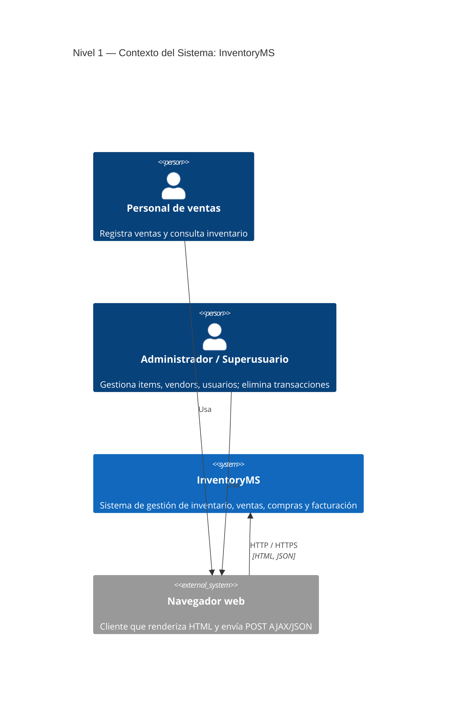
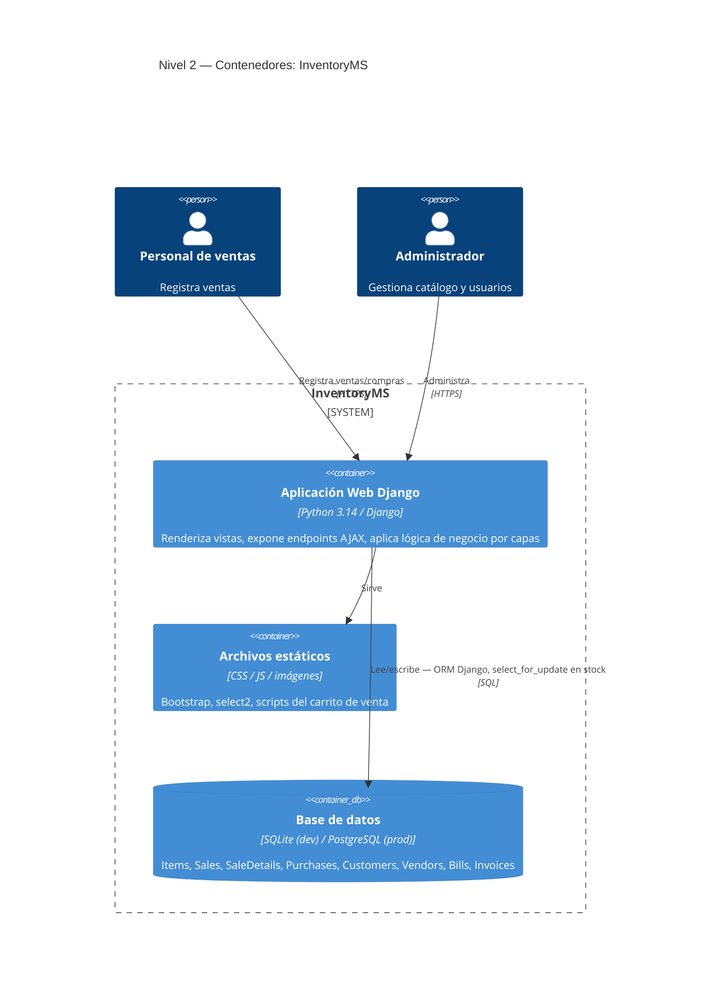
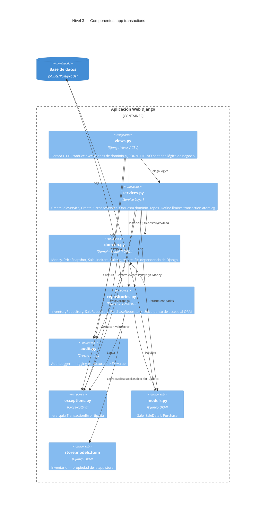
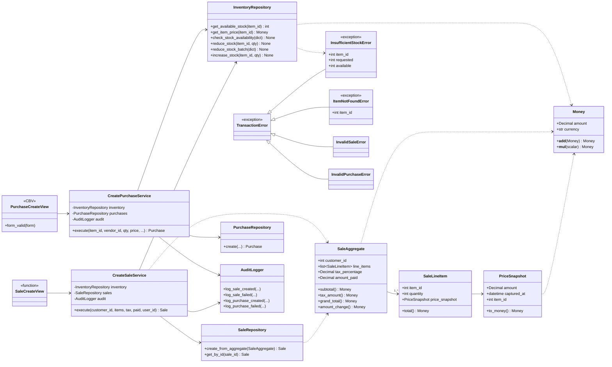

# Vistas Lógicas del Sistema — Modelo C4

> Sistema: **InventoryMS** (Django — inventario y transacciones)
> Alcance: arquitectura tras la re-arquitectura de `transactions/`
> Fecha: 2026-05-25

El modelo C4 (Context, Containers, Components, Code) describe la arquitectura en
cuatro niveles de zoom progresivo. Cada nivel responde a una audiencia distinta:
del stakeholder no técnico (Nivel 1) al desarrollador que mantiene el código
(Nivel 4).

| Nivel | Vista | Pregunta que responde | Audiencia |
|---|---|---|---|
| 1 | Contexto del Sistema | ¿Quién usa el sistema y con qué interactúa? | Todos |
| 2 | Contenedores | ¿De qué piezas desplegables se compone? | Técnica / DevOps |
| 3 | Componentes | ¿Cómo se organiza `transactions` internamente? | Desarrolladores |
| 4 | Código | ¿Qué clases y relaciones implementan los componentes? | Desarrolladores |

---

## Nivel 1 — Diagrama de Contexto del Sistema

Muestra InventoryMS como una caja negra y los actores que interactúan con él.

**Notas:**
- El sistema es un **monolito Django**: no consume APIs externas de pago,
  notificaciones ni terceros en su estado actual.
- La autorización distingue dos roles: el personal de ventas (`LoginRequiredMixin`)
  y el superusuario (`UserPassesTestMixin` para borrados).

---

## Nivel 2 — Diagrama de Contenedores

Hace zoom dentro de InventoryMS y muestra las unidades desplegables.

**Notas:**
- Un solo contenedor de aplicación (proyecto `InventoryMS/`) que agrupa las apps
  Django: `store`, `transactions`, `accounts`, `bills`, `invoice`.
- El acceso concurrente al stock se serializa a nivel de base de datos mediante
  `SELECT ... FOR UPDATE` (locks de fila) dentro de transacciones atómicas.
- `Dockerfile` presente → despliegue contenedorizado.

---

## Nivel 3 — Diagrama de Componentes (app `transactions`)

Hace zoom dentro del contenedor web, enfocado en la app re-arquitecturada.
Las flechas apuntan "hacia adentro" (hacia el dominio): la regla de dependencia
de la arquitectura por capas.

**Regla de dependencia (clave de la re-arquitectura):**
- `domain.py` no importa **nada** del proyecto → núcleo estable y testeable sin BD.
- `repositories.py` es el **único** componente que importa `store.models.Item`,
  eliminando el acoplamiento directo entre apps que tenía la vista original.
- `services.py` no importa `django.http` ni `django.views` → lógica de negocio
  reutilizable fuera del contexto HTTP.

---

## Nivel 4 — Diagrama de Código (clases de `transactions`)

Máximo nivel de detalle: clases y relaciones. Se omiten clases base de Django
para legibilidad.

---

## Resumen de las cuatro vistas

| Vista C4 | Elemento central | Aporta a la comprensión de... |
|---|---|---|
| Contexto | InventoryMS + actores | El propósito y los límites del sistema |
| Contenedores | App Django + BD + estáticos | Topología de despliegue |
| Componentes | Capas de `transactions` | Separación de responsabilidades y regla de dependencia |
| Código | Clases y excepciones | Implementación concreta de cada componente |
